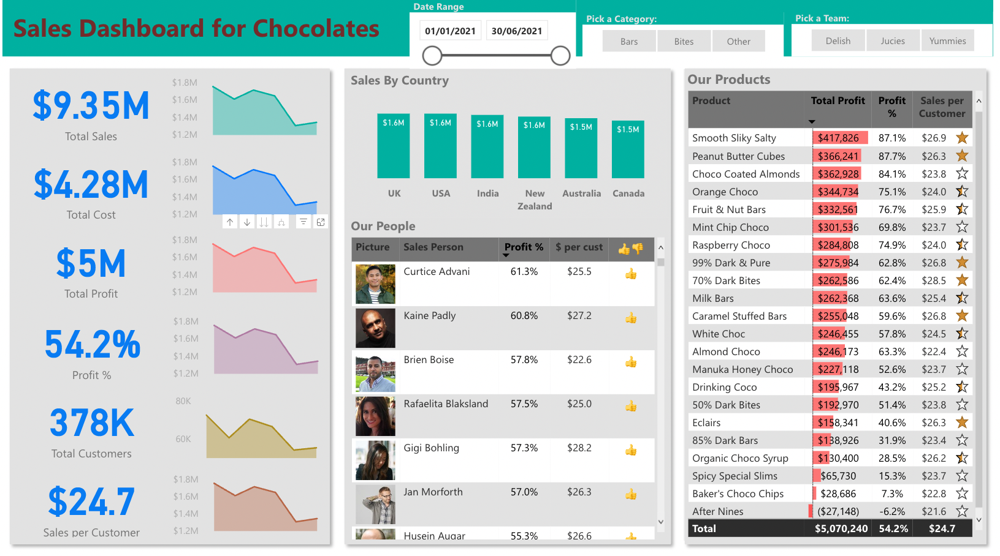

# Chocolate Sales Analysis using Power BI

This project involved analyzing chocolate sales data using Power BI to identify trends and insights. The data was sourced from a chocolate manufacturer and included information on sales by country, sales person, product, and customer.

## Project Overview

The project involved the following steps:

- Importing the chocolate sales data into Power BI
- Creating a data model to enable analysis and visualization
- Adding calculated fields and filtering options to allow for more in-depth analysis
- Creating a variety of visualizations and dashboards to better understand the data

## Visualizations and Dashboards [Power BI Report](https://app.powerbi.com/view?r=eyJrIjoiNDVlMWY5YmItYWUwYS00NzA5LTk0ZTEtY2FhNzZkNjM3OTU5IiwidCI6ImE2YWZkNmQ0LWJiMzctNGNkMC05MWZkLTk0MGQzNDFmMDIxYyJ9&pageName=ReportSection76182ad580e0c09e4a6e)

The following visualizations and dashboards were created as part of the analysis:

- Sales by country using a column chart
- Sales person profit % using a table
- Product and its total profit along with sales per customer
- Cards for various specifications including total sales, total profit, and sales per customer
- Date range and slicers for category and team
- Top sales product, top sales person, and country, for different categories and teams

## Insights and Conclusions

Through the analysis, several key insights were uncovered:

- The top-performing countries in terms of chocolate sales were the India, United States, and UK
- Sales people who were from Delish Team tended to be more profitable
- The most profitable product was Peanut Butter Cubes
- By filtering by category and team, it was possible to identify the top-performing sales people and products in each category and team

Overall, the analysis provided valuable insights into chocolate sales data and highlighted opportunities for growth and optimization.

## Files

The following files are included in this repository:

- `Sales analysis for Chocolates.pbix`: The Power BI file containing the data model and visualizations
- `pb-sales-analysis-blank.xlsx`: The raw data file used in the analysis

## Overview

